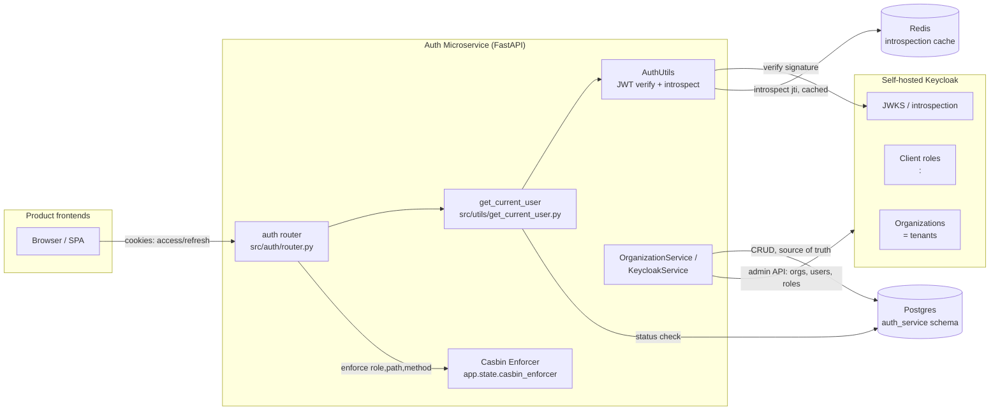

## TL;DR

I extracted authentication and authorization out of our FastAPI monolith into a standalone Auth Microservice, backed by a self-hosted Keycloak identity provider and a Casbin RBAC layer, with Postgres as the source of truth for organizations and users. Multi-tenancy is modeled with Keycloak's native Organizations feature, one org per tenant, with per-org and per-user product entitlements carried as Keycloak attributes and mirrored into JWT claims. The migration moved production traffic — multiple organizations and users across three internal products — off the old Auth0-based, per-monolith auth path with no forced re-registration.

## Context & the problem

The starting point (still visible in this repo's own README) was a "backend boilerplate" pattern: every product monolith carried its own auth slice — Auth0 for authentication, Casbin wired directly into that same FastAPI app for authorization, MongoDB via Beanie for user records. That's fine for one product. It stops being fine once you have three products that need to:

- recognize the same user and the same organization across product boundaries,
- gate access per-organization (an org licensed for one product shouldn't leak into another), and
- share one place to invite, disable, or purge a user instead of three.

Duplicating the auth slice per monolith meant duplicating bugs, duplicating the Auth0 tenant config, and — worst of all — no single place to answer "what does this org actually have access to?" The fix was to pull auth into its own service, put a real identity provider in front of it, and make organization and product entitlement first-class instead of something each monolith inferred from its own local user table.

## Architecture & approach

The service (`main.py`, `src/`) is a FastAPI app with three moving pieces:



Postgres (`auth_service` schema, via SQLAlchemy async + Alembic) is the system of record for organizations and users — everything the product backends actually query day-to-day. Keycloak owns credentials, sessions, and the JWT. Casbin owns the "can this role hit this route" decision. None of the three duplicate the others' job, but keeping Postgres as the source of truth (rather than treating Keycloak as one) was a deliberate call — see below.

Two details make the multi-tenancy model work:

- **Organizations map 1:1 onto Keycloak's native `Organizations` resource**, not realms. The Keycloak org id *is* the Postgres `organizations.id` (see `create_or_append_org` in `src/organization/services/keycloak_service.py`) — one shared primary key across both stores, no separate mapping table to keep in sync.
- **Product entitlement is an attribute, not a role hierarchy.** Both orgs and users carry a `platform` attribute (`["contract", "supplier", "unified"]`), and users additionally get Keycloak client roles shaped `<product>:<role>` (e.g. `contract:Admin`), with `Superadmin` as the one role that stays global. `assert_no_unified_mix()` in `src/common/enums/product.py` enforces that `unified` access is exclusive of the other two at the domain level.

## Key decisions & trade-offs

**Self-hosted Keycloak over a hosted IdP.**
The repo carries both a dev and prod Keycloak build (`keycloak.Dockerfile`, `keycloak.dev.Dockerfile`, `docker-compose.prod.yaml`), backed by our own Postgres instance rather than Keycloak's embedded DB. The previous stack used Auth0 (still visible in the `AUTH0_CLIENT_ID`/`AUTH0_CLIENT_SECRET` config names — a naming fossil from the migration). The trade-off was explicit: Auth0 is zero-ops, but its Organizations/RBAC model didn't fit our per-product, per-org entitlement shape without contorting it, and its usage-based pricing scales badly with multi-tenant volume. Self-hosted Keycloak meant owning upgrades and DB backups ourselves, but gave direct control over the org/attribute model and custom flows (magic-link invites, SSO-brokered orgs) the invite flow depends on.

**Postgres as source of truth, Keycloak as identity provider — not the other way around.**
It would have been simpler to let Keycloak's org/user data *be* the data. Instead, every org and user is persisted in Postgres, and Keycloak is an integration the app writes through (`KeycloakService`) and reads claims from at request time. The rejected alternative — reading org/user details live from Keycloak on every request — would put its admin API (not built for high-QPS reads) on the hot path, and would make product-side joins against other domain tables impossible without a bulk sync anyway.

**Attribute-based product entitlement over per-product realms.**
One realm, with product access expressed via the `platform` attribute plus scoped client roles, kept role management flat — one Casbin policy set, one JWKS endpoint — versus per-product realms, which would have meant re-authenticating every time a user's org crossed a product boundary.

## Implementation highlights

**1. Idempotent org creation that merges rather than overwrites.** Onboarding runs are re-run often (retries, partial failures), so org creation had to be safe to call twice:

```python
# src/organization/services/keycloak_service.py
def create_or_append_org(self, org_name: str, products: list[Product]) -> dict:
    existing = self._find_organization_by_name(org_name)
    if existing:
        full_org = admin.get_organization(existing.get("id"))
        current_platforms = self._platform_list(full_org.get("attributes") or {})
        merged = current_platforms + [
            p for p in [pr.platform for pr in products] if p not in current_platforms
        ]
        if merged != current_platforms:
            admin.update_organization(existing["id"], {..., "attributes": {**full_org.get("attributes", {}), "platform": merged}})
        return {"org_id": existing["id"], "existing": True}
    ...
```

The comment in the real function explains the subtlety: all platforms are written in a *single* KC call, because the org list endpoint returns shallow objects without attributes — looping per-product would silently clobber previously set platforms.

**2. JWT claims drive authorization without a database round-trip on every request.** `get_current_user` decodes Keycloak's client-role claims (`<product>:<role>`) straight into a role map, and only hits Postgres once, to check the user isn't soft-deleted:

```python
# src/utils/get_current_user.py
for raw_client_role in client_roles:
    if raw_client_role == UserRole.SUPERADMIN.value:
        is_superadmin = True
        continue
    if ":" not in raw_client_role:
        continue
    product, role_str = raw_client_role.split(":", 1)
    roles_map[product] = UserRole(role_str)
```

**3. Casbin enforcement as a targeted allowlist, not a blanket gate.** Rather than running every route through the enforcer, only routes with real authorization nuance are checked (`AuthUtils.casbin_enforced_routes`), and `Superadmin` short-circuits it entirely:

```python
# src/auth/router.py
if effective_role == "Superadmin" or path_tail not in AuthUtils.casbin_enforced_routes:
    return user_data
enforcer = req.app.state.casbin_enforcer
if not enforcer.enforce(effective_role, path_tail, req_method):
    raise HTTPException(403, detail="Forbidden")
```

**4. Session validity checked against Keycloak, with a Redis cache to keep it cheap.** Logout needs to actually kill a session, not just delete a cookie, so every request's token `jti` is introspected against Keycloak — but that's a network hop, so the result is cached for 60s and evicted immediately on logout:

```python
# src/auth/utils/auth_utils.py
async def introspect_token(token: str, jti: str) -> None:
    cached = await redis_client.get(f"{_INTROSPECT_CACHE_PREFIX}{jti}")
    if cached is not None:
        if cached == "0":
            raise HTTPException(status_code=401, detail="Session terminated")
        return
    ...
    await redis_client.set(cache_key, "1" if active else "0", ex=_INTROSPECT_CACHE_TTL)
```

Notably, this fails *open* on introspection outages (logged as a warning) — a deliberate call that an IdP hiccup shouldn't lock every user out.

## Challenges hit

**Migrating existing users without downtime.** The old data lived in MongoDB. `scripts/migrate_mongo_to_pg.py` copies Organization and User documents into Postgres first, converting Mongo `ObjectId`s into deterministic UUID5s so foreign keys stay consistent — and is written to be safely re-run (`ON CONFLICT DO NOTHING`). The catch: those Postgres IDs don't match Keycloak's own generated user/org IDs. The pipeline resolves that in three explicit, re-runnable stages: `migrate_mongo_to_pg.py` → `export_kc_import.py` (build a Keycloak-importable export) → `sync_pg_to_kc_ids.py --apply` (reconcile Postgres primary keys to the IDs Keycloak actually assigned on import). Splitting it up meant a failed run midway didn't corrupt the correspondence between the two stores — each stage could be inspected before the next ran against production.

**Mapping orgs onto Keycloak concepts.** Realms were the wrong unit — too heavyweight, one per tenant doesn't scale operationally and breaks a shared JWKS/login flow; groups don't carry the attribute-rich, invitable-member semantics needed. Keycloak's Organizations feature, plus a custom magic-link invite flow, fit best — but meant hand-rolling parts python-keycloak doesn't wrap (the org-invite and invitation-resend endpoints in `KeycloakService` are raw `requests` calls for exactly this reason).

**Wiring Casbin policies to org boundaries.** Casbin's own policy model (`model.conf`) is deliberately dumb — `sub, obj, act, eft` with no org dimension — because organization scoping is a data-filtering concern (a given Admin can only ever see rows in their own org), not a route-authorization concern. Baking org-id into the Casbin policy would have meant regenerating policy rows per organization; keeping Casbin scoped to role × route × method and enforcing org boundaries in the service/repository layer (`OrganizationRepository`, `UserRepository`) instead kept the policy table small — the whole seed in `src/auth/casbin_policy_seed.py` is under a dozen rows — and org-scoping logic in one place instead of duplicated into the policy engine.

**SSO-brokered orgs vs. magic-link orgs needing different invite flows.** Passwordless magic-link invites assume the user sets a password/OTP at Keycloak; that flow makes no sense for an org whose users authenticate at an upstream SSO IdP. `invite_user` branches on `sso_enabled` to skip required actions and pre-verify the email for SSO orgs, and swaps the invite mechanism entirely (Keycloak's native `organizations/{id}/members/invite-user` endpoint) instead of the magic-link call.

## Impact / results

In production, this consolidated authentication and authorization for 12 organizations (58 users) across three internal products (contract, supplier, and a unified surface) onto one service and one identity provider, replacing per-monolith Auth0 integrations. Concretely: one place to disable a user or an org and have it take effect everywhere (`purge_disabled_orgs.py`, `purge_deleted_users.py`), one JWKS endpoint instead of three, and org → product entitlement changes propagating to every member automatically instead of needing a per-monolith patch.

## What I'd do differently

- **Introduce the `platform` attribute model earlier.** A meaningful chunk of the script inventory (`sync_platform_roles.py`, `backfill_platform_both.py`, `add_unified_platform_to_superadmins.py`) exists specifically to backfill product entitlement onto orgs/users created before that shape was settled. Nailing the entitlement model before the first production org was created would have avoided several backfill passes.
- **Land the ID-alignment step as part of user creation, not a follow-up sync script.** `sync_pg_to_kc_ids.py` is necessary because Postgres and Keycloak IDs can drift when either side generates its own. In hindsight, always pre-generating the ID application-side (the pattern `invite_user` now uses for new users) from day one would have made `sync_pg_to_kc_ids.py` unnecessary rather than a permanent fixture.
- **Separate "soft delete" cleanup from day one.** The purge scripts (`purge_deleted_users.py`, `purge_disabled_orgs.py`) that hard-delete soft-deleted records from both Postgres and Keycloak came after the fact. Given how central soft-delete state (`OrgStatus`, `UserStatus`) is to the model, I'd design the retention/purge policy alongside the initial schema instead of bolting it on later.
