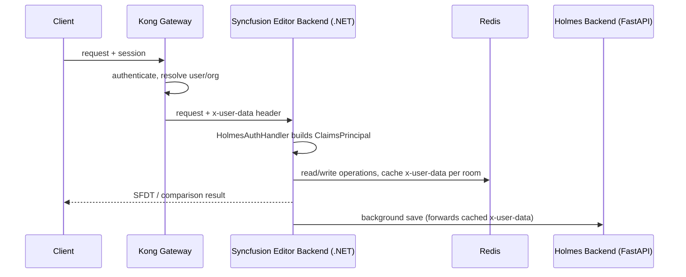

## TL;DR

I extended Syncfusion's ASP.NET Core Document Editor reference backend — the C# service that powers real-time collaborative document editing over SignalR — with two things it didn't ship with: a document comparison endpoint that produces tracked-changes output, and an authentication layer that trusts identity injected by our API gateway (Kong) instead of doing its own login flow. Along the way I had to touch the Redis-backed operation store and the autosave path so that saves keep working when authentication is no longer cookie-based.

## Context & the problem

Our product embeds Syncfusion's Document Editor for real-time collaborative editing. Syncfusion ships a reference backend for this (ASP.NET Core, SignalR hub, Redis-backed operation queue) that's meant as a starting point, not a finished service — it has no real auth, no document comparison, and its autosave logic assumes a single trusted caller. We forked it and had to make it fit into an existing system: a Python/FastAPI backend ("Holmes") behind a Kong API gateway that already owns authentication, session, and org membership, plus a product requirement (redlined document comparison) that the vendor package supports as a library feature (`WordDocument.Compare`) but the reference backend never exposes as an endpoint.

Two constraints shaped everything:

1. We didn't want to duplicate Holmes' auth logic (JWT validation, session lookup, org resolution) inside this C# service — that logic already lives at the gateway and in Holmes.
2. The editor's real-time save pipeline (Redis Lua scripts tracking versioned operations, a background queue that periodically flushes to source documents) had to keep working correctly under concurrent edits while both of these changes landed.

## Architecture / approach

Kong sits in front of both the FastAPI backend and this .NET service. It authenticates the request (validates the session/JWT) and, on the way through, injects the resolved identity as a JSON blob in an `x-user-data` header — the same contract the FastAPI backend's `get_current_user` dependency expects. This service never sees credentials; it only ever sees a header it trusts because it's only reachable through the gateway.

A custom `AuthenticationHandler` (`Authentication/HolmesAuthHandler.cs`) reads that header, parses `user_id`, `org_id`, and a few optional fields (name, email, role, status) into claims, and produces an `AuthenticationTicket`. Every `[Authorize]`-decorated controller and the SignalR hub then get a `ClaimsPrincipal` for free, same as if we'd built a full JWT pipeline — but without re-implementing one.



The document comparison feature hooks in at a different layer entirely — it doesn't touch the live collaborative session at all. `DocumentComparisonController` loads two documents (original from S3, revised from S3 or an uploaded file) as DocIO `WordDocument` instances, calls Syncfusion's `Compare(...)`, and converts the result into the EJ2 `WordDocument` format the editor's frontend already knows how to render as SFDT. It's a stateless, one-shot operation — no Redis, no operation store, no SignalR — deliberately kept out of the collaborative pipeline.

## Key decisions & trade-offs

**Header-based auth vs. re-implementing a full auth flow in the .NET service.**
Trusting a gateway-injected header meant we didn't have to duplicate JWT validation, session/refresh logic, or org resolution in a second language. The trade-off is that this service is only as secure as the assumption that it's unreachable except through Kong — there's no independent verification of the header's authenticity inside the handler itself. That's an acceptable trade-off for an internal service sitting entirely behind the gateway, but it's a real dependency worth calling out.

**SignalR auth over query string vs. header-only.**
Browser WebSocket clients can't set arbitrary headers on the initial handshake, so the SignalR hub connection can't rely on `x-user-data` arriving as a header the way REST calls do. `HolmesAuthHandler` falls back to reading the same value from the query string when the header is absent. This keeps one auth handler covering both REST and hub traffic instead of maintaining two.

**Comparison as a stateless side-endpoint vs. folding it into the operation store.**
Document comparison could theoretically have been modeled as another kind of "operation" applied through the same Redis-backed pipeline used for live edits. I kept it out entirely instead: it loads its own DocIO documents, runs `Compare`, and returns a fresh SFDT payload directly to the client. Routing it through the operation store would have meant reconciling comparison output (which rewrites large swaths of the document with tracked-change markup) against concurrent live edits in the same room — a correctness problem not worth taking on for a feature that's inherently a point-in-time snapshot, not a live edit.

**Persisting the identity header per room vs. re-deriving it per save.**
The background save worker runs outside the request pipeline (`QueuedHostedService`), so it has no `x-user-data` header to forward when it eventually calls Holmes' `/save-docx`. I capture the header at `ImportFile` time and cache it in Redis under `{room}_HolmesUserData`, then have the background worker read it back and forward it on the outbound save request. The alternative — giving the background service its own service-to-service credential — would have been cleaner in principle but meant introducing a second auth path into Holmes just for this one background call.

## Implementation highlights

**1. The auth handler reading the gateway-injected header, with a WebSocket fallback:**

```csharp
string? userData = Request.Headers[UserDataHeader];

// SignalR WebSocket clients can't set custom headers in browsers,
// so allow the gateway-injected value to ride on the query string too.
if (string.IsNullOrEmpty(userData))
    userData = Request.Query[UserDataHeader];

if (string.IsNullOrEmpty(userData))
    return Task.FromResult(AuthenticateResult.NoResult());
```

This is the single point where every request — REST or hub — picks up identity. `NoResult()` (rather than `Fail`) when the header is simply missing lets ASP.NET's normal challenge behavior kick in instead of masking it as a malformed-credential error.

**2. Caching identity for the background save worker:**

```csharp
// Auth happens at the gateway; persist the gateway-injected user
// identity so the background save worker can forward it to Holmes.
string userData = Request.Headers[Authentication.HolmesAuthHandler.UserDataHeader];
if (!string.IsNullOrEmpty(userData))
    await database.StringSetAsync(roomName + "_HolmesUserData", userData);
```

This runs in `ImportFile`, the first request when a document is opened for editing — the only point in the collaborative flow where we're guaranteed to have a live, gateway-authenticated request in hand.

**3. Document comparison producing tracked changes and converting formats:**

```csharp
originalDocument.Compare(revisedDocument, authorName, comparisonDate, comparisonOptions);

// Convert the compared DocIO document to EJ2 DocumentEditor format
ej2Document = ConvertDocIOToEJ2Document(originalDocument);
string sfdt = Newtonsoft.Json.JsonConvert.SerializeObject(ej2Document);
```

`Compare` is Syncfusion's own DocIO API — the actual diffing algorithm is vendor code I didn't write. My work was the endpoint around it: loading both documents from S3 (or an upload) as `DocIO.WordDocument`, running the compare, then round-tripping through a DOCX byte stream to get an `EJ2.DocumentEditor.WordDocument`, since the comparison API and the live-editing API use two different in-memory document representations that don't talk to each other directly.

**4. The Redis Lua script that keeps operation ordering atomic:**

```lua
-- Increment the version for each operation
local version = redis.call('INCR', versionKey)
...
-- Add the new item to the list and get the new length
local length = redis.call('RPUSH', listKey, item)
-- Retrieve operations since the client's version
local previousOps = redis.call('LRANGE', listKey, clientVersion, -1)
```

This predates my changes but is central to why the auth and comparison work had to be done carefully: every edit operation is versioned and appended atomically inside a single Lua script (`InsertScript` in `CollaborativeEditingHelper.cs`), so concurrent clients editing the same room can't race each other into an inconsistent operation list. Anything I added had to avoid introducing a second, non-atomic path into that same list.

## Challenges hit

**Working inside a vendor reference implementation.** The DocIO comparison API and the EJ2 collaborative-editing API are two separate object models within the same Syncfusion package, and they don't share document instances — hence the DOCX round-trip in `ConvertDocIOToEJ2Document`. There wasn't a documented "compare then hand off to the live editor" path, so this had to be reverse-engineered from the SDK's own serialization behavior (DocIO `.Save()` to a stream, then `EJ2.WordDocument.Load()` from that stream).

**Keeping autosave correct when identity moved out-of-band.** Before the gateway-header change, the save path used a cookie forwarded per-request; the commit history shows this evolving (`updated auth handler and service to accomodate the new cookie based holmes get_current_user flow`, then later `Replace cookie-based auth with gateway-injected x-user-data header`). The background save worker doesn't have a request context at all, so whichever identity mechanism was in use had to be captured up front and threaded through Redis to the point where the worker actually calls Holmes. Getting this wrong silently would have meant saves succeeding but attributed to no one, or failing outright — so a fair amount of the later commits (`compare fixes, update on document loading as well as log updates`) were about adding structured Serilog logging around exactly these save and load paths so failures would surface with enough context (room name, S3 key, operation count) to debug in production.

**Threshold-triggered partial saves competing with final saves.** The operation store triggers a background partial save every `SaveThreshold` operations (default 100, `Redis:SaveThreshold`), and a full save when the last user leaves a room. Both paths funnel into the same `QueuedHostedService` queue and both call `ApplyOperationsToSourceDocument`, which replays the accumulated `ActionInfo` list — including a transform step (`CollaborativeEditingHandler.TransformOperation`) for operations that haven't been transformed yet — against the source document. Making sure the comparison feature's document loading (`DocumentHelper`) didn't collide with this same S3 object during an in-flight save was mostly a matter of keeping comparison strictly read-only against S3 and never touching the Redis operation keys.

## Impact / results

Qualitatively: the service now integrates cleanly into our gateway-fronted architecture instead of running its own parallel auth system, which removed an entire class of "which auth mechanism applies here" bugs during the cookie-to-header migration. Document comparison shipped as a feature the vendor package didn't provide out of the box, reusing the same S3-backed document storage and DocIO/EJ2 conversion machinery already present in the codebase rather than adding a separate service. I don't have hard before/after metrics to quote here — this was infrastructure and feature work on an internal editor backend, not something we had dashboards on — so I'll leave it there rather than invent numbers.

## What I'd do differently

I'd push back earlier on doing service-to-service auth (dedicated credentials for the background worker calling Holmes) instead of caching and forwarding the gateway header — it's a smaller diff today but a slightly awkward trust boundary long-term: the background worker's authority to save a document rests on a header value that's now minutes old by the time it's used. I'd also have liked to add a lightweight contract test between the comparison endpoint's SFDT output and the live editor's expected schema — right now correctness there is verified by hand, and a vendor SDK upgrade could silently change serialization in a way that only shows up when someone opens a compared document in the editor.
