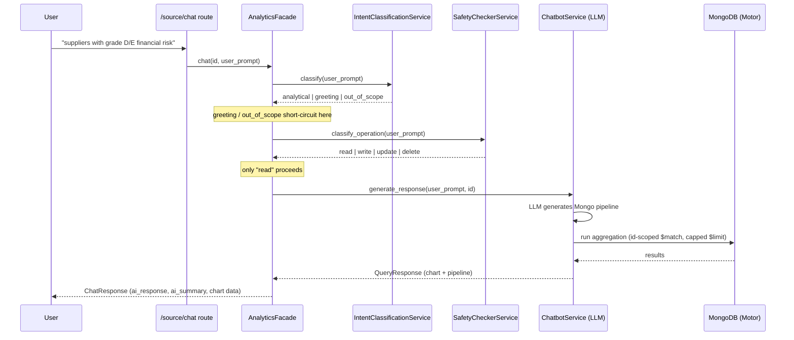

## TL;DR

I built the `/​{source}​/chat` endpoint that lets users ask plain-English questions ("which suppliers have grade D or E financial risk?") and get back a chart backed by a live MongoDB aggregation, instead of a query builder UI. The pipeline runs the prompt through an LLM intent classifier, then a separate LLM safety-check stage that rejects anything that isn't a read, before a third LLM call ever generates a Mongo query — and the same service is shared across two products (internally called `holmes` and `supplier`) through one FastAPI router keyed by a `source` path segment.

## Context & the problem

The platform is a supplier analytics tool — suppliers, contracts, risk grades (`legal_risk`, `financial_risk`, `quality_risk`, `price_risk`, each graded A–E), spend, and SLAs, sitting in MongoDB. Before this work, getting a chart out of that data meant going through a fixed set of pre-built dashboard graphs (`src/dashboard/supplier/supplier_graphs.py`). That's fine for the questions someone anticipated ahead of time — distribution by region, risk breakdown — but useless the moment someone asks something one level more specific, like "which suppliers in the US have a financial risk of D or E and total value over $1M." Standing up a query builder for that is its own UI project. The cheaper path was to let people just ask, and have an LLM turn the question into the aggregation pipeline that answers it.

## Architecture / approach

The whole thing lives behind a single `POST /{source}/chat` route (`src/router.py`), where `source` is `holmes` or `supplier` — the two products this service backs. The route resolves an `id` (org id for one product, user id for the other) from request state set by upstream auth middleware, then hands off to a per-product `AnalyticsFacade` (`SupplierAnalyticsFacade` / equivalent `holmes` facade) that owns the actual chat flow.



Four services compose the flow, each a thin wrapper around an LLM call with a dedicated system prompt and a Pydantic response schema:

- **`IntentClassificationService`** (`src/services/intent_classifier.py`) — classifies the prompt as `analytical`, `greeting`, or `out_of_scope` using a prompt that enumerates the actual schema (supplier fields, contract fields) so the model has something concrete to match against, rather than guessing from vibes.
- **`SafetyCheckerService`** (`src/services/safety_checker.py`) — classifies the *operation* the prompt implies: `read`, `write`, `update`, or `delete`. Only `read` is allowed through; everything else — including a failed/ambiguous classification — is treated as unsafe by design (`is_safe_operation` just checks `operation == OperationType.READ`).
- **`ChatbotService`** (`src/services/chatbot.py`) — the only stage that actually talks to Mongo. It takes the validated prompt, generates a query via the LLM, and executes it through `motor` (async pipeline or `find` depending on shape).
- **`SummaryService`** — turns the returned data back into a natural-language answer for the chat bubble, separate from the chart payload.

Data modeling underneath is Beanie (`src/models/base.py`, `src/models/dasboard.py`) — `BaseDocument` is a small `beanie.Document` subclass that auto-stamps `created_at`/`updated_at` on save/insert, and concrete documents like `Query` (`src/models/queries.py`) and `Dashboard` build on it. The chat pipeline itself talks to Mongo through raw `motor` (`AsyncIOMotorDatabase`) rather than Beanie models, since the LLM is generating ad-hoc aggregation stages against collections, not fixed documents — Beanie owns the structured side of the platform (saved dashboards, saved queries), while the chat path stays close to the driver so it can run whatever shape of pipeline comes out of the model.

Redis caching is centralized in a `CacheManager` singleton (`src/repository/cache_manager.py`, pickled values, TTL via `expire_seconds`, single Redis connection reused via `SingletonMeta`). It's shared by both products' client classes (`HolmesClient`, `SupplierClient`) for caching resolved user/org id lists — e.g. `HolmesClient.get_user_list` caches `user_list:org_id:{id}` for 24h and checks it before hitting Mongo. It is *not* currently used to cache LLM output or query results directly.

## Key decisions & trade-offs

**Decision: a dedicated intent-classification step before query generation, not one combined prompt.**
Why: collapsing intent detection and query generation into a single LLM call means every "hi" or off-topic question still pays for a full query-generation prompt (with schema context) and risks the model hallucinating a pipeline for a question that was never analytical to begin with. Splitting it lets greetings and out-of-scope prompts short-circuit with a static response (`GREETING_RESPONSE`, `OUT_OF_SCOPE_RESPONSE` in `src/core/constants.py`) before any query-generation cost is incurred.
Alternative considered/rejected: a single "generate query or explain why not" prompt — rejected because it makes the failure mode (a plausible-looking but wrong pipeline) harder to distinguish from a legitimate empty result.

**Decision: a separate safety-classification stage, defaulting closed.**
Why: the LLM that generates the query is instructed to only produce reads, but instructions aren't guarantees — an LLM-authored pipeline is still attacker- or mistake-controlled input as far as the database is concerned. `SafetyCheckerService.classify_operation` runs first and independently; anything that isn't cleanly classified as `read` — including a classifier failure — defaults to `WRITE`, which is treated as unsafe. Fail-closed on the ambiguous case, not fail-open.
Alternative considered/rejected: trusting the query-generation prompt's own "read-only" instruction and only validating the shape of the returned pipeline (e.g. rejecting stages containing `$out`/`$merge`). That's a real defense too, but it doesn't catch a prompt that never should have produced a query at all; the two are complementary, and this pipeline chose to gate on intent before ever generating the pipeline.

**Decision: constrain what the LLM is allowed to generate, rather than letting it write arbitrary Mongo.**
Why: `ChatbotService._run_generated_query` normalizes whatever comes back from the LLM into one of a few known shapes (`pipeline`, `filter`+`projection`, a bare aggregation stage, or a plain filter dict), enforces a hard cap (`min(limit, 1000)`, default 200) on every query path, and — critically — the facade injects a mandatory `id`-scoped `$match` (`is_deleted: false`, `uploaded_by: id`) into the system prompt as a non-negotiable first stage for the `suppliers` collection. The LLM chooses *what* to ask for; it never gets to choose *whose* data it's allowed to see.
Alternative considered/rejected: post-filtering results in application code after running an unscoped query. Rejected because an unscoped aggregation can already be expensive or leak aggregate counts (e.g. a `$group`/`$count` across all suppliers) before any post-filter gets a chance to trim the response.

## Implementation highlights

Scoping every generated query to the requesting user, injected straight into the system prompt rather than left to the model's judgment:

```python
# src/services/chatbot.py
if id:
    user_context = f"""
        CRITICAL USER CONTEXT:
        - Current id: "{id}"
        - For ALL queries on the "suppliers" collection, you MUST include BOTH:
          1. "is_deleted": false
          2. "uploaded_by": "{id}"
        - These filters are MANDATORY and must be the FIRST $match stage.
    """
    system_prompt = system_prompt + user_context
```

The safety gate is intentionally a one-liner — the classification does the real work, and the check itself has no room to drift:

```python
# src/services/safety_checker.py
def is_safe_operation(self, operation: OperationType) -> bool:
    return operation == OperationType.READ
```

Handling the LLM returning any of several plausible query shapes (a raw pipeline, a `filter`+`projection` pair, or a single aggregation stage) without trusting any one blindly, and always paginating:

```python
# src/services/chatbot.py
if isinstance(query_obj, dict):
    if "pipeline" in query_obj:
        return await run_pipeline(query_obj["pipeline"])
    if "filter" in query_obj:
        cursor = collection.find(query_obj["filter"], query_obj.get("projection"))
        cursor = cursor.limit(max(1, min(int(limit), 1000)))
        return [doc async for doc in cursor]
```

Beanie's base document, shared by every persisted model in the platform, to keep timestamp bookkeeping out of every call site:

```python
# src/models/base.py
class BaseDocument(Document):
    created_at: datetime = datetime.now(tz=timezone.utc)
    updated_at: Optional[datetime] = None

    async def save(self, *args, **kwargs):
        self.updated_at = datetime.now(tz=timezone.utc)
        return await super().save(*args, **kwargs)
```

## Challenges hit

**Ambiguous or over-constrained natural language.** A well-formed pipeline sometimes returned zero rows — the LLM took a filter phrase too literally, or combined filters that didn't intersect in the actual data. `ChatbotService._simplify_query` catches this: on an empty result set it strips a generated pipeline down to only its `$match`/`$group`/`$sort`/`$limit` essentials (re-applying the mandatory `uploaded_by`/`is_deleted` scope) and retries once before giving up and returning an explicit "try a broader question" message instead of a silent empty chart.

**Preventing expensive or unbounded queries.** Every query path funnels through the same limit enforcement — `min(int(limit), 1000)` — whether the LLM returned an aggregation pipeline, a `find`+`filter`, or a bare stage dict, so there's no code path where a generated query can return an unbounded result set.

**Dates in LLM output aren't real dates.** The model returns ISO-looking date strings inside filter values (`"2024-01-01"`), which don't match datetimes stored in Mongo without conversion. `_convert_dates_in_query` walks the generated query recursively and coerces anything matching an ISO pattern into a real `datetime` before execution — the commit history (`13084dd`, "added flex date parsing in chatbot.py") tracks this as a fix that came out of real query failures, not a day-one design.

**Two products, one pipeline, no shared user-id semantics.** `holmes` scopes by `org_id`, `supplier` scopes by `user_id` — the router resolves the correct `id` per `source` at the edge (`id = user_id if source == "supplier" else org_id`) so the facade and chatbot service downstream never have to know which product they're serving.

## Impact / results

Qualitatively: this replaced "request a new pre-built chart" with "ask the question," for the class of questions that fit inside the two collections the assistant has schema context for (suppliers, contracts). The intent/safety split also means the expensive path (query generation + execution) is only ever reached for prompts that passed two cheaper classification calls first, which keeps the common non-analytical traffic (greetings, off-topic questions) from ever reaching the database layer.

Latency tracked directly with how many LLM round trips a given prompt needed. A greeting or out-of-scope prompt only pays for the intent-classification call before `SupplierAnalyticsFacade.chat` returns early with a static response — that path responded in about 5 seconds. An analytical prompt that needed a chart, by contrast, walks the facade's full sequence of *awaited* calls back-to-back — intent classification, then the safety check, then `ChatbotService.generate_response` (query generation plus the Mongo execution itself), then `SummaryService.generate_summary` to turn the result set into the chat reply — four sequential LLM round trips with no concurrency between them, since none of those calls are independent of the previous one's output. That chain is what pushed graph-producing responses to 10–15 seconds; the 5s/10-15s split isn't two different code paths so much as it's the same facade with either one LLM call or four in series.

## What I'd do differently

- **Re-enable the caching that's already scaffolded but commented out.** `SupplierClient.get_user_list` has the exact same cache-then-query pattern as `HolmesClient.get_user_list`, just disabled (`src/services/supplier/supplier_client.py`) — worth revisiting why, and either turning it back on or removing the dead code.
- **Cache LLM-generated query results, not just id lookups.** Right now `CacheManager` is only used for resolving user/org id lists; a semantically-similar-prompt cache (or at minimum a cache on the generated pipeline itself, keyed by prompt + scope) would cut both LLM cost and Mongo load on repeated questions.
- **Validate pipeline shape explicitly, not just operation intent.** The safety check classifies the user's *intent*, but nothing inspects the LLM's *generated pipeline* for disallowed stages (`$out`, `$merge`, `$function`) as a second, independent guard — defense in depth would catch a safety-classifier miss that the query-generation prompt doesn't.
