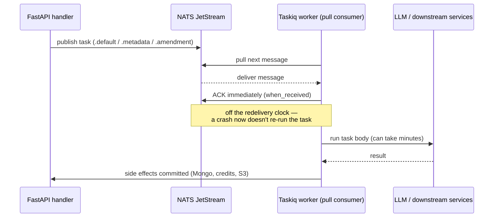

## TL;DR

Our backend runs long, LLM-backed background jobs — contract metadata extraction, subclause identification, amendment generation — on a task queue. Celery on Redis was letting these jobs get re-executed under worker restarts and redelivery edge cases, which for an LLM call means burning money and writing duplicate side effects into the database. We replaced it with [Taskiq](https://taskiq-python.github.io/) on NATS JetStream's durable pull-based consumers, split the workload into three dedicated queues, and moved acknowledgment to message delivery instead of task completion.

## Context & the problem

The backend is a FastAPI service with Beanie/MongoDB that offloads anything LLM-bound to background workers. `src/celery_app.py` wired a single Celery app against Redis as both broker and result backend, with tasks split across a `default_queue` and `metadata_queue` by string name. That's a fine starting point for sub-second jobs, but it strains once the tasks are minutes-long LLM calls:

- **Redis as a broker has no durable, replayable log.** A Redis outage or worker crash mid-task could drop a job silently, or redeliver it, with no consumer-level bookkeeping to tell the two apart.
- **Sync-over-async everywhere.** Every task was a plain `def` calling `loop.run_until_complete(...)`, fighting the fact that everything downstream — Beanie, the LLM client, S3 — was already async.
- **One flat queue shape for very different workloads.** Investigation, drafting, subclause identification, metadata extraction, and interactive amendment-fixing all competed for the same Redis-backed queues, so a burst of long jobs could starve latency-sensitive ones.
- **Duplicate LLM execution.** The concrete incident that forced this migration: an LLM call running tens of seconds to minutes would outlive the broker's ack window and get redelivered to a second worker before the first attempt reported success. Because the call has side effects (writing hierarchy nodes, decrementing credit balances, mutating Mongo documents), a duplicate run wasn't just wasted spend, it was duplicated data needing manual cleanup.

## Architecture / approach

We moved the task layer onto `taskiq_nats.PullBasedJetStreamBroker`, backed by one JetStream stream, `HOLMES_TASKIQ_JS1`, with file-backed storage and limits-based retention (`src/taskiq_brokers.py`):

```python
_STREAM_NAME = "HOLMES_TASKIQ_JS1"
_SUB_IDS = "default", "metadata", "amendment"

_STREAM_CONFIG = StreamConfig(
    subjects=[f"{_STREAM_NAME}.*"],
    storage=StorageType.FILE,
    max_msgs=_MAX_MSGS,
    retention=RetentionPolicy.LIMITS,
)
```

Instead of Celery's named queues, we get three **subjects on the same stream** — `.default`, `.metadata`, `.amendment` — each bound to its own durable JetStream consumer and its own worker process (`scripts/taskiq-worker-1.sh`, `-2.sh`, `-3.sh`):

- **`default`** — investigation, subclause identification, contract drafting. The general-purpose, highest-volume lane.
- **`metadata`** — batch metadata extraction, which also kicks off hierarchy building once a batch finishes. Isolated because it runs on every file upload and shouldn't queue behind slower drafting jobs.
- **`amendment`** — the fix-in-amendments flow, a recursive, credit-metered job that walks a hierarchy tree fixing issues one batch at a time. Isolated because it's latency-sensitive (a user is waiting) and re-enqueues itself, so it shouldn't compete with batch throughput.

Scaling a queue is just adding more `taskiq worker` processes against that broker — no separate routing config.



### The early-ack fix

The duplicate-execution bug came down to one flag, changed across three worker scripts. Taskiq's NATS integration supports `--ack-type`: `when_executed` (ack after the task returns) or `when_received` (ack as soon as the message is pulled). We started on `when_executed`, which sounds safer — except JetStream's redelivery timer runs against the *unacked* window, and a multi-minute LLM call sits well inside the range where a redeploy or a tight `ack_wait` triggers redelivery before the first attempt even finishes. The fix:

```diff
 taskiq worker --workers 2 --max-async-tasks 25 \
-    --ack-type when_executed \
+    --ack-type when_received \
     src.taskiq_brokers:default_broker src.redline.tasks
```

The moment a worker pulls the message it's acked and off JetStream's redelivery clock, so the call runs exactly once per successful delivery. The specific number that made this non-optional: our consumers run with a 30-second ack-timeout, and LLM calls routinely run well past that. Under `when_executed`, any call that took longer than 30 seconds to *finish* was guaranteed to look "unacked" to JetStream and get redelivered to a second worker while the first was still running. The trade-off: a crash *during* the call now loses the task instead of retrying automatically. We accepted that because these tasks aren't idempotent — they write hierarchy state and decrement credits — so a redelivery-based retry that fires mid-call was already the wrong safety net. Retry, where we need it, is handled explicitly at the application layer (see below), not by the broker.

## Key decisions & trade-offs

**NATS (with JetStream) over staying on Redis, or introducing RabbitMQ.** The notifications infrastructure elsewhere in the platform already ran on a NATS instance, so adopting NATS for tasks meant reusing operational knowledge and infrastructure we already had, rather than standing up a third broker technology. Plain NATS is interest-based pub/sub — a message published to a subject with no active subscriber is simply dropped — so JetStream is what makes it viable as a task queue at all: it layers persistence over subjects via streams, so messages are captured to disk (`StorageType.FILE`) regardless of whether a consumer happens to be listening at publish time. Alternative considered: Celery on Redis Streams. Rejected — it doesn't fix the sync/async mismatch, and we'd still be paying an infra cost for a broker with no other use in the system, instead of reusing one already running.

**Early ack over ack-after-completion.** For multi-minute tasks with real side effects, ack-after-completion is exactly the setup that causes duplicate execution under redelivery. Alternative: keep `when_executed` and tune `ack_wait` upward. Rejected — there's no value that's both long enough for worst-case LLM latency and short enough for crash-recovery to mean anything; you're just choosing a failure mode, and duplicate LLM execution was the more expensive one.

**Three subjects on one stream, not three streams or one queue.** A flat queue let long metadata jobs starve interactive amendment fixes; separate streams would've meant duplicated retention config for no benefit. Subjects on one stream get independent consumer groups and worker pools with a single retention policy.

**Explicit cross-subject publishing over one shared broker.** Each subject is its own `PullBasedJetStreamBroker` with its own connection, so a worker on `.amendment` originally couldn't publish onto `.metadata`. Fixed by having each broker's startup hook open publisher-only connections to the other brokers in a registry, so any worker can publish cross-subject without subscribing to it.

## Implementation highlights

**Broker registry keyed by subject, not a monolithic app object:**

```python
_broker_registry: Dict[str, PullBasedJetStreamBroker] = {}

def create_broker(sub_id: str):
    if sub_id not in _SUB_IDS:
        raise Exception("Unknown Subject ID")
    subject = f"{_STREAM_NAME}.{sub_id}"
    broker = PullBasedJetStreamBroker(
        servers=NATS_SERVER_ADDRESS,
        stream_name=_STREAM_NAME,
        subject=subject,
        durable=sub_id,
        consumer_config=ConsumerConfig(filter_subject=subject),
    )
    _broker_registry[sub_id] = broker
```

`default_broker`, `metadata_broker`, and `amendment_broker` are all the same call, differing only by `sub_id`. Adding a fourth queue is one entry in `_SUB_IDS` plus a new worker script.

**Task registration reads like the old Celery decorators**, which made the migration mechanical: `@celery_app.task(queue="...")` → `@<queue>_broker.task(task_name="...")`, and every `loop.run_until_complete(service.do_thing(...))` collapsed to `await service.do_thing(...)` since the function is natively `async def` now.

**Recursion-safe retry handled at the application layer, not the broker.** `fix_in_amendments_task` re-enqueues itself for the next batch of issues in a hierarchy tree. Since broker-level auto-retry was traded away for early ack, the exit condition and in-flight guard live in Redis:

```python
if not len(results):
    redis_client.eval(eval_script, 1, f"amend:{target_tree.id}:init")
    return logger.info("TASK EXIT")

redis_client.set(file_key, str(amendment_file.id), ex=3600)
```

The Redis key doubles as the "is a fix already running for this tree" lock and the recursion's termination signal — the task keeps re-publishing to `amendment_broker` until the aggregation query comes back empty.

## Challenges hit

- **Duplicate LLM execution** was the trigger for the whole project — traced to the `when_executed` redelivery window and closed with the single `--ack-type` change, once we understood exactly which window JetStream was enforcing.
- **Migrating without dropping in-flight jobs.** Celery and Taskiq don't share a broker, so there was no live drain from Redis into JetStream. The cutover let in-flight Celery jobs finish against the old broker while new work was routed to Taskiq from the moment new workers came up.
- **Observability parity.** Celery/Redis had years of on-call familiarity; JetStream didn't. We added `TaskMetricsMiddleware` (`src/utils/taskiq_util.py`), hooked on `post_execute`, logging NATS stream/consumer state (message count, bytes, consumer count, reconnects, async errors) and Redis stats (hit rate, evictions, GET/SET latency percentiles) after every task, plus OTEL instrumentation via `TaskiqInstrumentor().instrument()` — so the same "check queue depth, check hit rate" debugging habit still works.
- **Cross-queue publishing wasn't free**, since each subject holds its own connection — solved by the publisher-connection bootstrap in each broker's startup hook.

## Impact / results

Duplicate execution of LLM-backed tasks — the incident class that triggered this work — stopped after the `when_received` change, since the 30-second ack-timeout can no longer race an in-flight LLM call. Splitting `default`/`metadata`/`amendment` onto independent consumers means a burst of metadata extraction from a large upload no longer competes with interactive amendment-fix latency.

## What I'd do differently

Early ack trades broker-level retry for correctness, and I'd make that trade-off explicit in code rather than a flag buried in a shell script — easy for someone to "fix" back to `when_executed` without knowing why it's there. I'd also build the idempotency guard pattern in `fix_in_amendments_task` as a shared utility from the start, since every long-running LLM task in this system needs the same shape of guard and right now it's implemented ad hoc, per task, wherever it happened to be needed.
